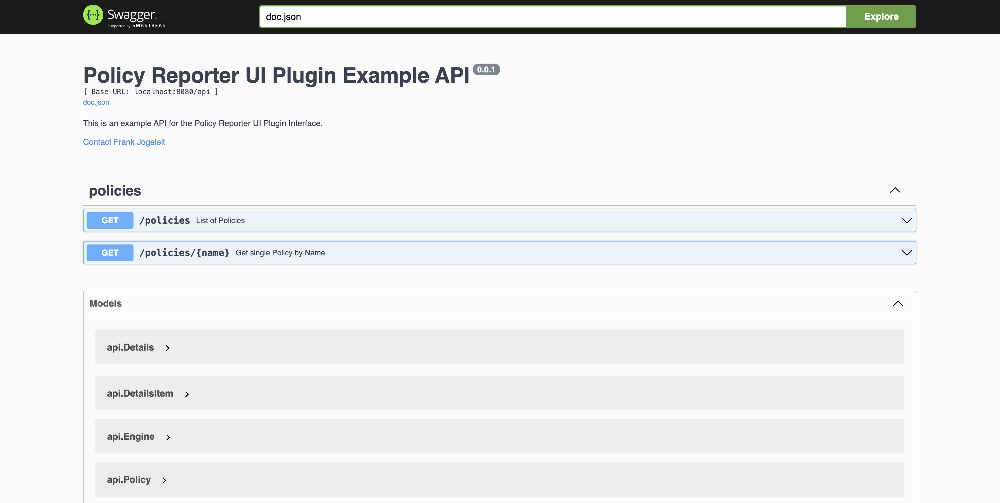

# Policy Reporter Plugins Monorepo

## Introduction

With Policy Reporter UI v2 a new plugin system will be introduced. While Plugins in v1 were only used for integrating the [Policy Reporter Kyverno Plugin](https://github.com/kyverno/policy-reporter-kyverno-plugin), the new system will be much more generic and needs to provide a defined REST API, no actual UI changes are required. Plugin information will be included in existing views and providing details about policies assiciated with the PolicyReportResults.

## Official Plugins

This repostiory provides two plugins for Policy Reporter UI v2.

### Kyverno Plugin

An updated version of the already existing "Policy Reporter Kyverno Plugin". It provides the new APIs as well existing features like PolicyReport generation for blocked Admission Requests.

### Trivy Plugin

The new Trivy Plugin provides details about results comming from VulnerabilityReports. While the actual results still comming from PolicyReports created by [Trivy Operator Polr Adapter](https://github.com/fjogeleit/trivy-operator-polr-adapter), the plugin provides details about CVEs and GHSA foundings, like detailed description, affected / fixed versions and references.

## API

One Plugin relates to one "source" of PolicyReports. An Plugin has to implement two APIs.

### [GET] Policies API

The `/policies` API provides a list of Policies. This could be a list of all policies provided or a list of all policies which produced a __PolicyReportResult__.

#### Trivy Plugin

```json
[
  {
    "category": "Vulnerability Scan",
    "name": "GHSA-m425-mq94-257g",
    "title": "gRPC-Go HTTP/2 Rapid Reset vulnerability",
    "description": "### Impact\nIn affected releases of gRPC-Go, it is possible for an attacker to send HTTP/2 requests, cancel them, and send subsequent requests, which is valid by the HTTP/2 protocol, but would cause the gRPC-Go server to launch more concurrent method handlers than the configured maximum stream limit.\n\n### Patches\nThis vulnerability was addressed by #6703 and has been included in patch releases: 1.56.3, 1.57.1, 1.58.3.  It is also included in the latest release, 1.59.0.\n\nAlong with applying the patch, users should also ensure they are using the `grpc.MaxConcurrentStreams` server option to apply a limit to the server's resources used for any single connection.\n\n### Workarounds\nNone.\n\n### References\n#6703\n",
    "severity": "high"
  },
  {
    "category": "Vulnerability Scan",
    "name": "GHSA-9763-4f94-gfch",
    "title": "CIRCL's Kyber: timing side-channel (kyberslash2)",
    "description": "### Impact\nOn some platforms, when an attacker can time decapsulation of Kyber on forged cipher texts, they could possibly learn (parts of) the secret key.\n\nDoes not apply to ephemeral usage, such as when used in the regular way in TLS.\n\n### Patches\nPatched in 1.3.7.\n\n### References\n- [kyberslash.cr.yp.to](https://kyberslash.cr.yp.to/)",
    "severity": "high"
  },
  {
    "category": "Vulnerability Scan",
    "name": "CVE-2021-3121",
    "title": "CVE-2021-3121",
    "description": "An issue was discovered in GoGo Protobuf before 1.3.2. plugin/unmarshal/unmarshal.go lacks certain index validation, aka the \"skippy peanut butter\" issue.",
    "severity": "high"
  },
  {
    "category": "Vulnerability Scan",
    "name": "CVE-2023-44487",
    "title": "CVE-2023-44487",
    "description": "The HTTP/2 protocol allows a denial of service (server resource consumption) because request cancellation can reset many streams quickly, as exploited in the wild in August through October 2023.",
    "severity": "high"
  },
  {
    "category": "Vulnerability Scan",
    "name": "CVE-2023-46219",
    "title": "CVE-2023-46219",
    "description": "When saving HSTS data to an excessively long file name, curl could end up\nremoving all contents, making subsequent requests using that file unaware of\nthe HSTS status they should otherwise use.\n",
    "severity": "medium"
  }
]
```

#### Kyverno Plugin

```json
[
  {
    "category": "Kasten K10 by Veeam",
    "namespace": "default",
    "name": "k10-data-protection-by-label",
    "title": "Check Data Protection By Label",
    "description": "Check the 'dataprotection' label that production Deployments and StatefulSet have a named K10 Policy. Use in combination with 'generate' ClusterPolicy to 'generate' a specific K10 Policy by name.      "
  },
  {
    "category": "Pod Security Standards (Baseline)",
    "name": "disallow-capabilities",
    "title": "Disallow Capabilities",
    "description": "Adding capabilities beyond those listed in the policy must be disallowed.",
    "severity": "medium"
  },
  {
    "category": "Pod Security Standards (Restricted)",
    "name": "disallow-capabilities-strict",
    "title": "Disallow Capabilities (Strict)",
    "description": "Adding capabilities other than `NET_BIND_SERVICE` is disallowed. In addition, all containers must explicitly drop `ALL` capabilities.",
    "severity": "medium"
  },
  {
    "category": "Pod Security Standards (Baseline)",
    "name": "disallow-host-namespaces",
    "title": "Disallow Host Namespaces",
    "description": "Host namespaces (Process ID namespace, Inter-Process Communication namespace, and network namespace) allow access to shared information and can be used to elevate privileges. Pods should not be allowed access to host namespaces. This policy ensures fields which make use of these host namespaces are unset or set to `false`.",
    "severity": "medium"
  },
  {
    "category": "Pod Security Standards (Baseline)",
    "name": "disallow-host-path",
    "title": "Disallow hostPath",
    "description": "HostPath volumes let Pods use host directories and volumes in containers. Using host resources can be used to access shared data or escalate privileges and should not be allowed. This policy ensures no hostPath volumes are in use.",
    "severity": "medium"
  }
]
```

### [GET] Policy API

The `/policies/{name}` API provides details of a single policy selected by its unique name.

Examples:

```
http://localhost:8084/policies/CVE-2022-41723
http://localhost:8083/policies/restrict-apparmor-profiles

// kyverno example of an namespace scoped policy
http://localhost:8083/policies/default/restrict-apparmor-profiles
```

#### Trivy Plugin

```json
{
  "category": "",
  "name": "CVE-2022-41723",
  "title": "CVE-2022-41723",
  "description": "A maliciously crafted HTTP/2 stream could cause excessive CPU consumption in the HPACK decoder, sufficient to cause a denial of service from a small number of small requests.",
  "engine": {
    "name": "Trivy",
    "subjects": [
      "Pod",
      "ReplicaSet"
    ]
  },
  "references": [
    {
      "url": "https://go.dev/issue/57855"
    },
    {
      "url": "https://go.dev/cl/468135"
    },
    {
      "url": "https://go.dev/cl/468295"
    },
    {
      "url": "https://groups.google.com/g/golang-announce/c/V0aBFqaFs_E"
    },
    {
      "url": "https://pkg.go.dev/vuln/GO-2023-1571"
    },
    {
      "url": "https://lists.fedoraproject.org/archives/list/package-announce@lists.fedoraproject.org/message/4MA5XS5DAOJ5PKKNG5TUXKPQOFHT5VBC/"
    },
    {
      "url": "https://lists.fedoraproject.org/archives/list/package-announce@lists.fedoraproject.org/message/RLBQ3A7ROLEQXQLXFDLNJ7MYPKG5GULE/"
    },
    {
      "url": "https://lists.fedoraproject.org/archives/list/package-announce@lists.fedoraproject.org/message/RGW7GE2Z32ZT47UFAQFDRQE33B7Q7LMT/"
    },
    {
      "url": "https://lists.fedoraproject.org/archives/list/package-announce@lists.fedoraproject.org/message/XX3IMUTZKRQ73PBZM4E2JP4BKYH4C6XE/"
    },
    {
      "url": "https://www.couchbase.com/alerts/"
    },
    {
      "url": "https://lists.fedoraproject.org/archives/list/package-announce@lists.fedoraproject.org/message/4BUK2ZIAGCULOOYDNH25JPU6JBES5NF2/"
    },
    {
      "url": "https://lists.fedoraproject.org/archives/list/package-announce@lists.fedoraproject.org/message/T7N5GV4CHH6WAGX3GFMDD3COEOVCZ4RI/"
    },
    {
      "url": "https://lists.fedoraproject.org/archives/list/package-announce@lists.fedoraproject.org/message/REMHVVIBDNKSRKNOTV7EQSB7CYQWOUOU/"
    },
    {
      "url": "https://security.gentoo.org/glsa/202311-09"
    }
  ],
  "details": [
    {
      "title": "Assigner",
      "value": "Go"
    },
    {
      "title": "Published",
      "value": "2023-02-28T17:19:45.801Z"
    }
  ],
  "additional": [
    {
      "title": "Affected Versions",
      "items": [
        {
          "title": "net/http",
          "value": "from 0 before 1.19.6"
        },
        {
          "title": "net/http",
          "value": "from 1.20.0-0 before 1.20.1"
        },
        {
          "title": "golang.org/x/net/http2",
          "value": "from 0 before 0.7.0"
        },
        {
          "title": "golang.org/x/net/http2/hpack",
          "value": "from 0 before 0.7.0"
        }
      ]
    }
  ]
}
```

#### Kyverno Plugin

```json
{
  "category": "Pod Security Standards (Baseline)",
  "name": "disallow-capabilities",
  "title": "Disallow Capabilities",
  "description": "Adding capabilities beyond those listed in the policy must be disallowed.",
  "severity": "medium",
  "engine": {
    "name": "Kyverno",
    "version": "1.6.0",
    "subjects": [
      "Pod"
    ]
  },
  "code": {
    "contentType": "yaml",
    "content": "apiVersion: kyverno.io/v1\nkind: ClusterPolicy\nmetadata:\n  annotations:\n    kyverno.io/kubernetes-version: 1.22-1.23\n    kyverno.io/kyverno-version: 1.6.0\n    meta.helm.sh/release-name: kyverno-policies\n    meta.helm.sh/release-namespace: kyverno\n    policies.kyverno.io/category: Pod Security Standards (Baseline)\n    policies.kyverno.io/description: Adding capabilities beyond those listed in the\n      policy must be disallowed.\n    policies.kyverno.io/minversion: 1.6.0\n    policies.kyverno.io/severity: medium\n    policies.kyverno.io/subject: Pod\n    policies.kyverno.io/title: Disallow Capabilities\n  labels:\n    app.kubernetes.io/component: kyverno\n    app.kubernetes.io/instance: kyverno-policies\n    app.kubernetes.io/managed-by: Helm\n    app.kubernetes.io/name: kyverno-policies\n    app.kubernetes.io/part-of: kyverno-policies\n    app.kubernetes.io/version: 3.1.0\n    helm.sh/chart: kyverno-policies-3.1.0\n  name: disallow-capabilities\nspec:\n  admission: true\n  background: true\n  failurePolicy: Fail\n  rules:\n  - match:\n      any:\n      - resources:\n          kinds:\n          - Pod\n    name: adding-capabilities\n    preconditions:\n      all:\n      - key: '{{ request.operation || ''BACKGROUND'' }}'\n        operator: NotEquals\n        value: DELETE\n    validate:\n      deny:\n        conditions:\n          all:\n          - key: '{{ request.object.spec.[ephemeralContainers, initContainers, containers][].securityContext.capabilities.add[]\n              }}'\n            operator: AnyNotIn\n            value:\n            - AUDIT_WRITE\n            - CHOWN\n            - DAC_OVERRIDE\n            - FOWNER\n            - FSETID\n            - KILL\n            - MKNOD\n            - NET_BIND_SERVICE\n            - SETFCAP\n            - SETGID\n            - SETPCAP\n            - SETUID\n            - SYS_CHROOT\n      message: Any capabilities added beyond the allowed list (AUDIT_WRITE, CHOWN,\n        DAC_OVERRIDE, FOWNER, FSETID, KILL, MKNOD, NET_BIND_SERVICE, SETFCAP, SETGID,\n        SETPCAP, SETUID, SYS_CHROOT) are disallowed.\n  validationFailureAction: Audit\nstatus:\n  autogen:\n    rules:\n    - exclude:\n        resources: {}\n      generate:\n        clone: {}\n        cloneList: {}\n      match:\n        any:\n        - resources:\n            kinds:\n            - DaemonSet\n            - Deployment\n            - Job\n            - StatefulSet\n            - ReplicaSet\n            - ReplicationController\n        resources: {}\n      mutate: {}\n      name: autogen-adding-capabilities\n      preconditions:\n        all:\n        - key: '{{ request.operation || ''BACKGROUND'' }}'\n          operator: NotEquals\n          value: DELETE\n      validate:\n        deny:\n          conditions:\n            all:\n            - key: '{{ request.object.spec.template.spec.[ephemeralContainers, initContainers,\n                containers][].securityContext.capabilities.add[] }}'\n              operator: AnyNotIn\n              value:\n              - AUDIT_WRITE\n              - CHOWN\n              - DAC_OVERRIDE\n              - FOWNER\n              - FSETID\n              - KILL\n              - MKNOD\n              - NET_BIND_SERVICE\n              - SETFCAP\n              - SETGID\n              - SETPCAP\n              - SETUID\n              - SYS_CHROOT\n        message: Any capabilities added beyond the allowed list (AUDIT_WRITE, CHOWN,\n          DAC_OVERRIDE, FOWNER, FSETID, KILL, MKNOD, NET_BIND_SERVICE, SETFCAP, SETGID,\n          SETPCAP, SETUID, SYS_CHROOT) are disallowed.\n    - exclude:\n        resources: {}\n      generate:\n        clone: {}\n        cloneList: {}\n      match:\n        any:\n        - resources:\n            kinds:\n            - CronJob\n        resources: {}\n      mutate: {}\n      name: autogen-cronjob-adding-capabilities\n      preconditions:\n        all:\n        - key: '{{ request.operation || ''BACKGROUND'' }}'\n          operator: NotEquals\n          value: DELETE\n      validate:\n        deny:\n          conditions:\n            all:\n            - key: '{{ request.object.spec.jobTemplate.spec.template.spec.[ephemeralContainers,\n                initContainers, containers][].securityContext.capabilities.add[] }}'\n              operator: AnyNotIn\n              value:\n              - AUDIT_WRITE\n              - CHOWN\n              - DAC_OVERRIDE\n              - FOWNER\n              - FSETID\n              - KILL\n              - MKNOD\n              - NET_BIND_SERVICE\n              - SETFCAP\n              - SETGID\n              - SETPCAP\n              - SETUID\n              - SYS_CHROOT\n        message: Any capabilities added beyond the allowed list (AUDIT_WRITE, CHOWN,\n          DAC_OVERRIDE, FOWNER, FSETID, KILL, MKNOD, NET_BIND_SERVICE, SETFCAP, SETGID,\n          SETPCAP, SETUID, SYS_CHROOT) are disallowed.\n  conditions:\n  - lastTransitionTime: \"2024-01-11T11:44:04Z\"\n    message: Ready\n    reason: Succeeded\n    status: \"True\"\n    type: Ready\n  ready: true\n  rulecount:\n    generate: 0\n    mutate: 0\n    validate: 1\n    verifyimages: 0\n  validatingadmissionpolicy:\n    generated: false\n    message: \"\"\n"
  },
  "details": [
    {
      "title": "Background",
      "value": "enabled"
    },
    {
      "title": "Admission",
      "value": "enabled"
    },
    {
      "title": "FailurePolicy",
      "value": "Fail"
    },
    {
      "title": "Mode",
      "value": "Audit"
    }
  ]
}
```

## Example Client

In `/example` you find an example plugin service with fixture content and a Swagger UI.

